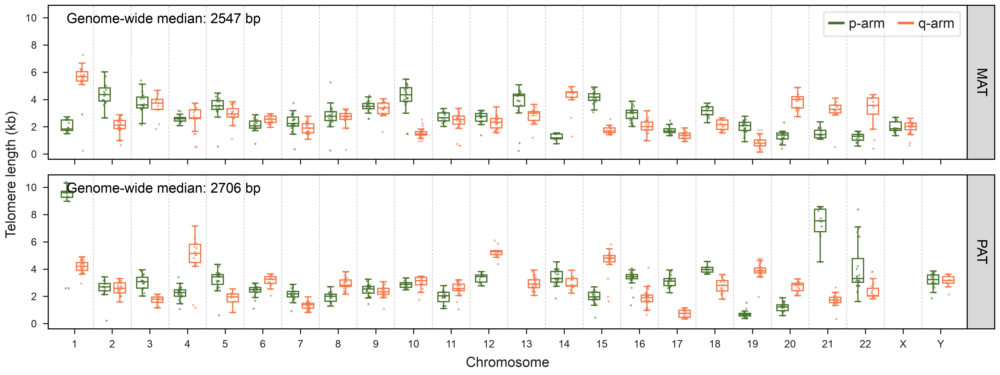
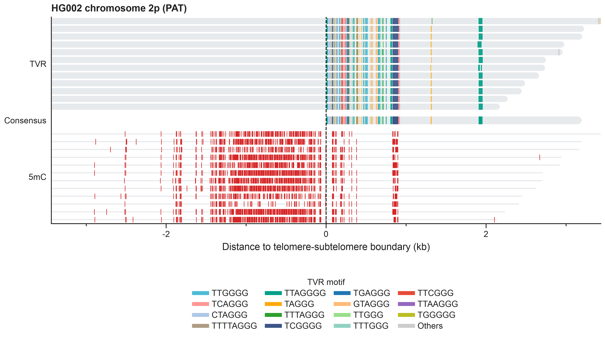
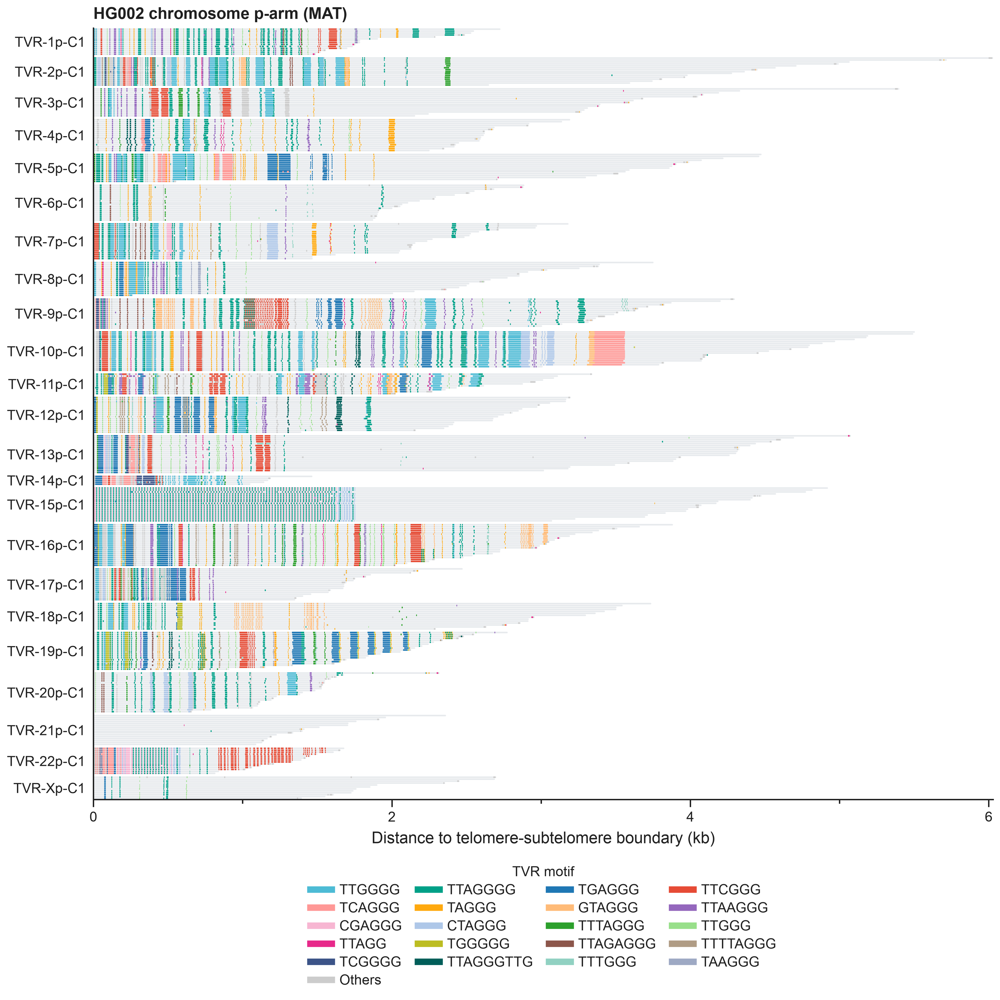
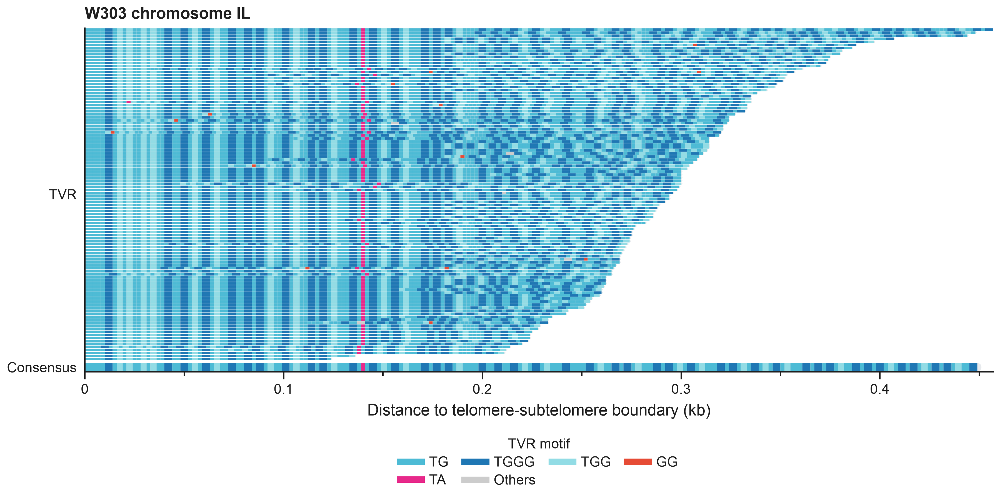
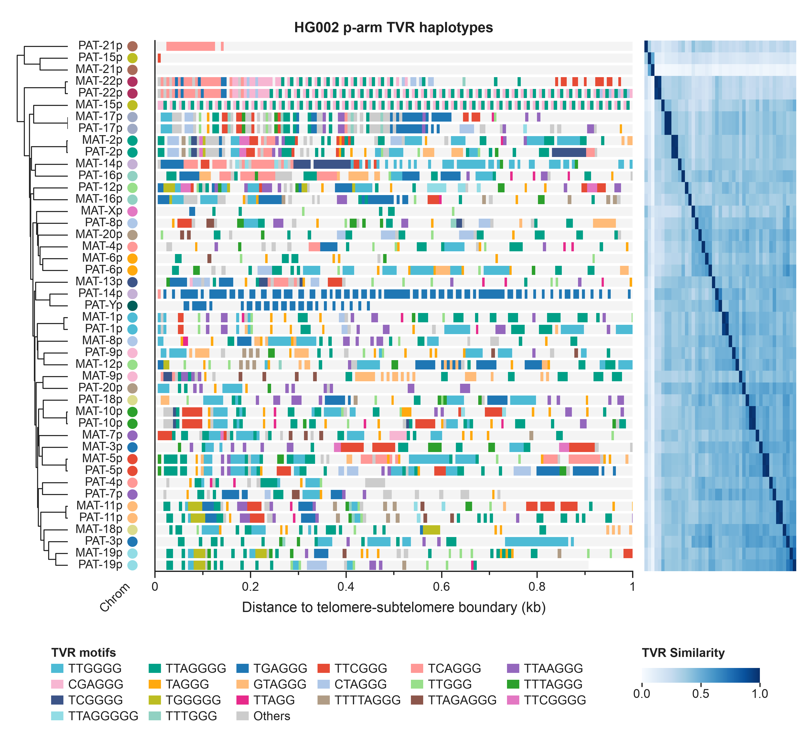
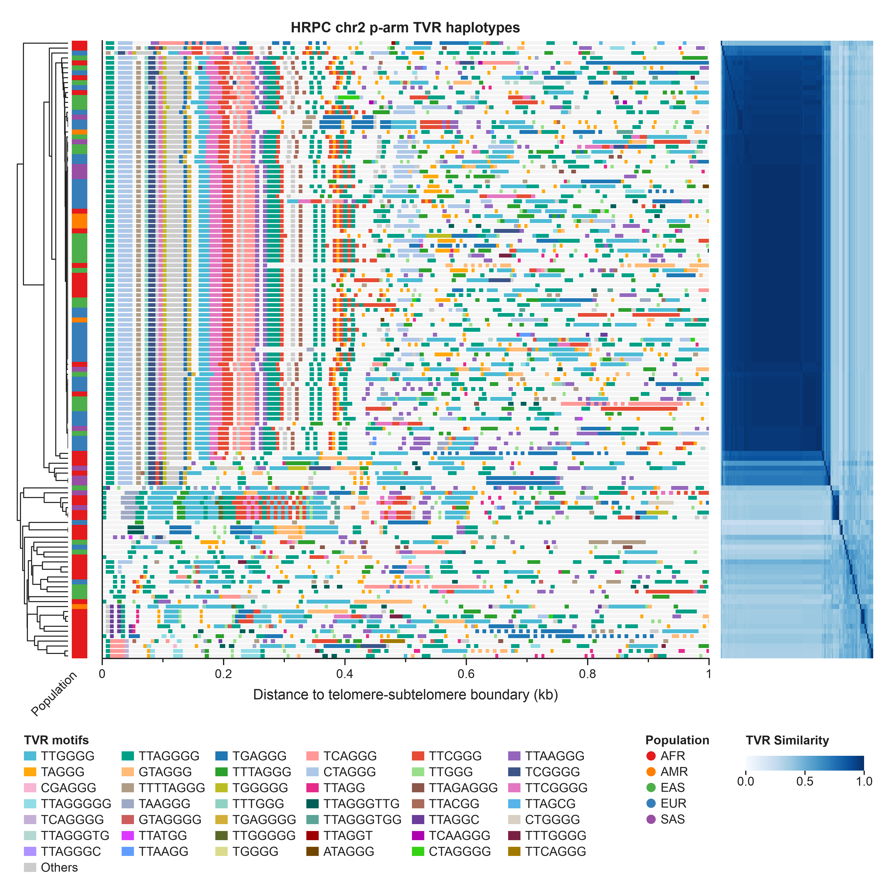
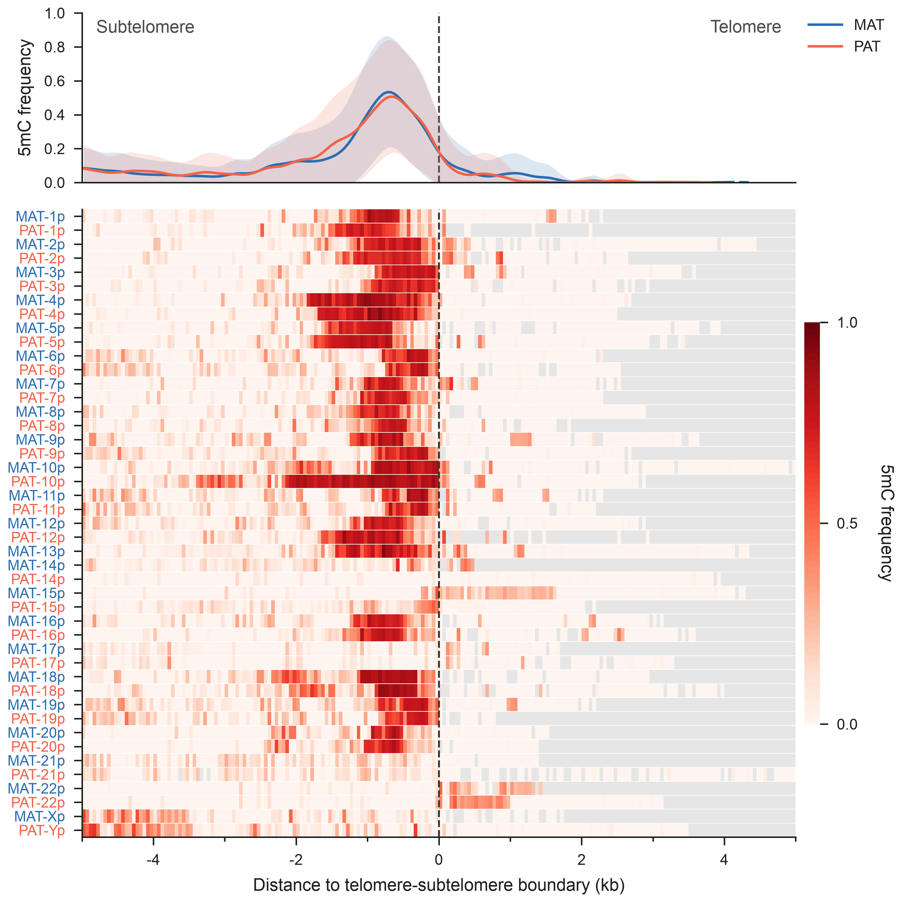

# TeloXplorer

[](https://anaconda.org/huihui_li/teloxplorer)
[](LICENSE)

TeloXplorer (`telox`) is a modular framework for chromosome-end-resolved telomere analysis using long-read sequencing data (ONT and PacBio) or genome assemblies.

## Features

* **Chromosome-end resolution:** Assigns telomeric reads to chromosome ends using subtelomeric alignments.
* **Telomere profiling:**
  * **Length:** Infers telomere-subtelomere (T-S) boundaries and classifies chromosome-end telomeres (**chromtel**), internal neotelomeres (**neotel**), and minitelomeres (**minitel**).
  * **Telomere variant repeats:** Resolves telomere variant repeats (TVRs) and reconstructs chromosome-end TVR haplotype consensus sequences.
  * **DNA methylation:** Maps 5-methylcytosine (5mC) and 5-hydroxymethylcytosine (5hmC) calls relative to inferred T-S boundaries.
* **Flexible species support:** Provides presets for human, mouse, yeast, and *Arabidopsis* telomeres and accepts user-defined telomere motifs.
* **Visualization:** Generates publication-quality figures for telomere length distributions, single-molecule TVR architectures, TVR haplotypes, and methylation profiles.

## Installation

Install the current release from the `huihui_li` channel. Bioconda and
conda-forge provide the remaining runtime dependencies:

```bash
conda install -c huihui_li -c bioconda -c conda-forge teloxplorer=0.5.0
```

> [!NOTE]
>
> The Bioconda release is pending review of the `telox-pyabpoa` recipe. Until
> it is merged, keep `huihui_li` as the highest-priority channel.

**Dependencies:** [minimap2](https://github.com/lh3/minimap2), [samtools](https://github.com/samtools/samtools), [seqtk](https://github.com/lh3/seqtk).

## Quick Start

The `telox run` command executes read screening, alignment, telomere-length estimation, and TVR analysis in one workflow. Methylation profiling is added when `--modbam` is used.

```bash
telox run \
  --preset human \
  --fastq reads.fastq.gz \
  --ref ref.fa \
  --mm2-opts "-ax map-ont" \
  --min-read-qual 10 \
  --min-tel-qual 20 \
  --outdir telox_output \
  --prefix sample_01 \
  --threads 16 \
  --plot-length \
  --start-step 1
```

Exactly one of `--fastq`, `--bam`, or `--modbam` must be provided. The `--start-step` option resumes at step 1-5: extraction, alignment, length estimation, TVR analysis, or methylation profiling.

### Presets

Use `--preset` to apply species-specific motif, terminal-region, and signal-processing parameters. Individual parameters, such as `--motif` and `--terminal-range`, can be overridden.

| Preset         | Motif pattern(s)                  | Terminal range | Notes                                              |
| :------------- | :-------------------------------- | :------------- | :------------------------------------------------- |
| human          | `TTAGGG`                          | 500k           | Standard vertebrate configuration                  |
| human-r9       | `TTAGGG\|TTAAAA\|CCAGGG\|AAGAAG`  | 500k           | ONT R9-specific alternative motif patterns         |
| mouse          | `TTAGGG`                          | 500k           | Mouse configuration                                |
| yeast          | `TG{1,3}`                         | 20k            | Variable TG-rich repeats in *S. cerevisiae*        |
| arabidopsis    | `TTTAGGG`                         | 20k            | Standard plant configuration                       |
| arabidopsis-r9 | `TTTAGGG\|CCCAGG`                 | 20k            | ONT R9-specific alternative motif patterns         |

> [!NOTE]
>
> **Other species:** Select a base preset with a comparable telomere repeat architecture, then review the motif, terminal-region span, density threshold, and smoothing parameters. For example, the *Caenorhabditis elegans* motif and terminal-region span can be set as follows:
>
> ```bash
> telox run --preset human --motif "TTAGGC" --ref <ref> --terminal-range "20k"
> ```
## Outputs

The end-to-end workflow generates the following principal outputs. The methylation directory is populated only when `--modbam` is provided.

```text
telox_output/
├── 01_reads/
│   └── sample_01.tel_like.fastq
├── 02_align/
│   └── sample_01.sort.bam
├── 03_length/
│   ├── sample_01.chromtel.length.tsv           # Chromosome-end telomere lengths
│   ├── sample_01.chromtel.length_plot.pdf      # Telomere length plot, if requested
│   ├── sample_01.chromtel.summary.tsv          # Telomere length summary
│   ├── sample_01.chromtel.seq.fasta            # Telomere sequences (input for telox-tvr)
│   ├── sample_01.neotel.length.tsv             # Neotelomere lengths
│   ├── sample_01.minitel.length.tsv            # Minitelomere lengths
│   └── sample_01.failed.length.tsv             # Filtered/failed reads
├── 04_tvr/
│   ├── sample_01.chromtel.TVR.count.tsv        # TVR counts (arm-level)
│   ├── sample_01.chromtel.TVR.haplotype.tsv    # TVR haplotype consensus (arm-level)
│   └── sample_01.chromtel.TVR.plot_data.tsv    # TVR coordinates (read-level)
└── 05_methyl/
    └── sample_01.chromtel.mods.plot_data.tsv   # Read-level C, 5mC, and 5hmC coordinates
```

## TeloX Modules

TeloXplorer is modular, and each step can be run independently.

```bash
Usage: telox [OPTIONS] COMMAND [ARGS]...

Core commands:
  run             Run the complete end-to-end telomere pipeline
  align           Extract telomere-like reads and align to the reference genome
  length          Estimate telomere lengths from alignments
  tvr             Profile TVR composition and build haplotype consensus
  methyl          Map 5mC/5hmC modification calls relative to T-S boundaries

Standalone commands:
  asm             Estimate telomere lengths directly from genome assemblies
  reads           Estimate telomere lengths directly from unaligned long reads

Visualization commands:
  plot-length     Plot chromosome-end telomere length distributions
  plot-reads      Plot single-molecule TVR architectures and methylation states
  plot-tvr-hap    Plot TVR haplotype consensus, clustering, and similarity heatmap
  plot-methyl     Plot T-S boundary methylation heatmaps and aggregate 5mC frequency curves
```

Visualization commands accept `--format pdf|png|svg`; PDF is the default.

### 1. telox-align

`telox-align` uses the multithreaded C++ utility `telogrep` to identify reads containing at least five consecutive motif copies in either orientation. Candidate reads are aligned to the reference genome using [minimap2](https://github.com/lh3/minimap2). Downstream analysis retains primary alignments with read length ≥1 kb and mapping quality ≥20 before chromosome-end assignment.

```bash
telox align --preset human --fastq reads.fq.gz --ref ref.fa -o outdir -p sample_01
```

* `--motif` (preset): Telomere motif or regular expression, specified in the right-arm or G-rich orientation, for example `TTAGGG`.
* `--min-read-qual` (default: 0): Minimum average Phred read quality during screening.
* `--mm2-opts` (default: `-ax map-ont`): Options passed to `minimap2`. Use `-ax map-pb` or `-ax map-hifi` for PacBio data.
* `--min-mapq` (default: 20): Minimum mapping quality retained during alignment.

### 2. telox-length

`telox-length` converts exact motif matches into a base-resolution occupancy profile and calculates local motif densities. BLOOM iteratively merges adjacent segments with similar signals, after which fuzzy motif matching recovers local losses caused by sequencing errors or TVRs. A directional penalty-and-reward model scans the profile from the distal read end. The position with the maximum cumulative score defines the inferred T-S boundary.

```bash
telox length --preset human --bam outdir/02_align/sample_01.sort.bam --ref ref.fa -o outdir -p sample_01
```

* `--terminal-range` (preset): Span from each chromosome end used to define the terminal region; accepts suffixes such as `500k`.
* `--min-anchor-len` (preset): Minimum subtelomeric alignment length in bp.
* `--min-tel-len` (preset): Minimum inferred telomere length in bp.
* `--max-offset` (preset): Maximum distal non-telomeric offset in bp; `-1` disables the limit.
* `--baseline-density` (preset): Motif-density threshold separating telomeric segments from gaps.
* `--fuzzy-mismatch` (preset): Maximum mismatches per motif during fuzzy-density recovery.
* `--bloom-pwidth` and `--bloom-ydis` (preset): Horizontal and vertical tolerances used by BLOOM.
* `--min-tel-qual` (default: 0): Minimum average Phred quality of the inferred telomeric tract. Lower-quality sequences are excluded from downstream TVR analysis.

### 3. telox-tvr

`telox-tvr` normalizes telomeric sequences to a common orientation and decomposes them into ordered repeat units. Candidate TVRs are identified across  *k*-mer lengths and reading phases, standardized by cyclic equivalence, and resolved by anchor-guided local dynamic programming. Reads from each chromosome end are clustered with [HDBSCAN](https://github.com/scikit-learn-contrib/hdbscan) using normalized Levenshtein distances between tokenized repeat strings. For each cluster, up to 150 of the longest reads are used to build an [abPOA](https://github.com/yangao07/abPOA) consensus, followed by custom hidden Markov model refinement.

```bash
telox tvr --preset human --telseq outdir/03_length/sample_01.chromtel.seq.fasta -o outdir -p sample_01
```

* `--kmers` (preset): Comma-separated *k*-mer lengths, for example `5,6,7,8,9` for the human preset.
* `--min-cluster-size` (preset): Minimum number of reads required for a valid TVR haplotype cluster.
* `--cluster-epsilon` (preset): Distance threshold for HDBSCAN subcluster merging.
* `--max-depth` (default: 150): Maximum number of the longest reads used for POA consensus construction per cluster.

> [!NOTE]
>
> *S. cerevisiae* telomeres derive much of their repeat diversity from the variable canonical motif `TG{1,3}`. The yeast preset therefore represents TG, TGG, and TGGG as distinct repeat units during decomposition and clustering.

### 4. telox-methyl

`telox-methyl` extracts MM/ML-encoded modification probabilities from ModBAM reads that overlap inferred T-S boundaries. Canonical cytosine probability is calculated as one minus the summed probabilities of declared cytosine modifications. The highest-probability state among C, 5mC, and 5hmC is retained when it passes the corresponding threshold. Coordinates are normalized by read strand and chromosome arm, with the inferred T-S boundary at position 0. Telomeric coordinates are positive and subtelomeric coordinates are negative.

```bash
telox methyl --modbam input.modbam --telseq outdir/03_length/sample_01.chromtel.seq.fasta -o outdir -p sample_01
```

* `--subtel-extension` (default: 10k): Distance extending inward from the T-S boundary into the subtelomere; accepts suffixes such as `10k`.
* `--c-threshold` (default: 0.66): Minimum probability for canonical cytosine.
* `--mod-m-threshold` (default: 0.90): Minimum probability for 5mC.
* `--mod-h-threshold` (default: 0.90): Minimum probability for 5hmC.

## Alternative Workflows

Besides alignment-based telomere length estimation, TeloXplorer supports direct estimation from genome assemblies and long reads through standalone modules:

### 1. telox-asm

`telox-asm` extracts terminal sequences from both ends of each assembled chromosome or contig. It applies the BLOOM smoothing and directional scoring procedures used by `telox-length`. Telomere length is measured from the assembly terminus to the inferred T-S boundary.

```bash
telox asm --preset human --assembly chm13v2.0.fa --terminal-length 500k -o outdir -p chm13
```

- `--terminal-length` (preset): Sequence span extracted from each chromosome end; accepts suffixes such as `500k`.
- `--masked-fasta`: Optional output FASTA with inferred telomeric regions masked with Ns.

### 2. telox-reads

`telox-reads` provides reference-free telomere-length estimation for raw long reads. It applies the screening procedure from `telox-align` and evaluates each candidate read in both motif orientations using the `telox-length` boundary algorithm. Because no reference alignment is used, results are not assigned to specific chromosome ends.

```bash
telox reads --preset human --fastq reads.fastq.gz -o outdir -p sample_01 --threads 16
```

## Visualization

TeloXplorer provides four plotting commands. PDF is the default output format; use `--format png` or `--format svg` when needed. The images below are documentation previews.

### 1. plot-length: Telomere Length Distributions

`plot-length` summarizes `telox-length` output using per-read points and chromosome-end boxplots. Phased inputs are arranged in separate rows, whereas unphased inputs are shown in a single panel.

```bash
telox plot-length \
  --input outdir/03_length/HG002.chromtel.length.tsv \
  --outdir outdir/plots \
  --prefix HG002 \
  -W 8 -H 3
```

The command writes `<prefix>.length_plot.<format>`. Point layers are automatically rasterized above 20,000 plotted reads; use `--rasterize` or `--no-rasterize` to override this behavior.



### 2. plot-reads: Single-Molecule TVRs and Methylation Tracks

`plot-reads` visualizes single-molecule TVR architectures from `telox-tvr` output. Within each TVR haplotype, optional tracks are arranged as TVR → Consensus → 5mC. The inferred T-S boundary is position 0, with negative subtelomeric and positive telomeric coordinates.

**Plot single-molecule TVR architectures with 5mC:**

```bash
telox plot-reads \
  --tvr outdir/04_tvr/HG002.chromtel.TVR.plot_data.tsv \
  --consensus outdir/04_tvr/HG002.chromtel.TVR.haplotype.tsv \
  --mods outdir/05_methyl/HG002.chromtel.mods.plot_data.tsv \
  --xlim "none" \
  --chroms chr2 \
  --top-tvr 20 \
  --outdir outdir/plots \
  --prefix HG002 \
  -W 6 -H 3.5
```

* `--tvr` / `--sample-sheet`: Provide exactly one read-level TVR file or a headerless two-column `SAMPLE TVR_FILE` sheet. Consensus and modification tracks are supported only with `--tvr`.
* `--consensus`: Optional `*.TVR.haplotype.tsv` input TVR haplotype consensus file.
* `--mods`: Optional `*.mods.plot_data.tsv` input telomere modification file.
* `--xlim`: Plot limits as `MIN_BP,MAX_BP` relative to the inferred T-S boundary. Use `none` for the full span of each output panel; the default remains `0,2000`.
* `--chroms`: Comma-separated list of chromosomes to plot.
* `--top-tvr`: Maximum motifs assigned distinct colors per sample and arm within the plotted interval.
* `--show-outliers`: Show reads assigned to the `Outlier` cluster; they are hidden by default.
* `--read-thickness`: Read-track thickness as a fraction of row spacing in `(0,1]`.
* `--consensus-thickness`: Positive consensus-track thickness relative to row spacing.



**Pool chromosomes within each phase and arm:**

```bash
telox plot-reads \
  --tvr outdir/04_tvr/HG002.chromtel.TVR.plot_data.tsv \
  --xlim "none" \
  --pool-chroms \
  --top-tvr 20 \
  --outdir outdir/plots \
  --prefix HG002 \
  -W 6 -H 6
```

- `--pool-chroms`: Pool selected chromosomes by phase and arm.



> [!NOTE]
>
> Both TVR plotters assign a unique color to every individually selected motif. `--tvr-colors` overrides take priority, followed by curated colors and a deterministic extended palette; duplicate overrides and palette exhaustion raise an error instead of recycling colors. The resolved `<prefix>.tvr_colors.tsv` map can be passed back to `--tvr-colors` to freeze colors across figures.

**For yeast, pass an empty canonical background motif to color TG, TGG, and TGGG explicitly alongside other repeat units:**

```bash
telox plot-reads \
    --motif "" \
    --tvr outdir/04_tvr/W303.chromtel.TVR.plot_data.tsv \
    --consensus outdir/04_tvr/W303.chromtel.TVR.haplotype.tsv \
    --outdir outdir/plots \
    --prefix W303 \
    --top-tvr 10 \
    --xlim "none" \
    --consensus-thickness 3 \
    --chroms chrI \
    -W 6 -H 3
```



### 3. plot-tvr-hap: TVR Haplotypes and Clustering

`plot-tvr-hap` visualizes chromosome-end TVR haplotype consensus sequences, hierarchical clustering, pairwise similarity, and categorical annotations. Provide exactly one `--consensus` file or a headerless two-column `SAMPLE CONSENSUS_FILE` sheet. Row clustering and the similarity heatmap are enabled by default.

**Single-sample clustering with similarity heatmap (e.g., HG002 ONT R10 WGS):**

```bash
telox plot-tvr-hap \
  --motif "TTAGGG" \
  --consensus outdir/04_tvr/HG002.chromtel.TVR.haplotype.tsv \
  --top-tvr 20 \
  --tvr-colors tvr_colors.tsv \
  --xlim 1000 \
  --cluster-proximal-bp 250 \
  --annotation-columns chrom \
  --row-label-columns chrom_phase,chrom,arm \
  --annotation-colors annotation-colors.tsv \
  --write-similarity-score \
  --outdir outdir/plots \
  --prefix HG002 \
  -W 10 -H 5
```

* `--motif`: Canonical motif rendered as the telomeric background.
* `--cluster-rows` / `--no-cluster-rows`: Enable or disable average-linkage hierarchical clustering.
* `--cluster-proximal-bp`: Proximal span used for pairwise motif-aware haplotype distances.
* `--xlim`: Maximum displayed telomeric span in bp. Use `none` for the full span of each output panel; the default remains 2000 bp.
* `--row-label-columns`: Comma-separated columns for row labels. Default: `auto` ('chrom,arm' / 'sample_id,chrom,arm'). Use `none` to hide row labels.
* `--pool-arms`: Pool p/q or L/R arms into one plot.
* `--pool-chroms`: Pool selected chromosomes within each arm in multi-sample plots.
* `--rasterize` / `--no-rasterize`: Force or disable rasterization. By default, tracks remain vector and only similarity heatmaps with at least 1,000 haplotypes are rasterized.
* `--write-similarity-score`: Write pairwise scores to `*.similarity.tsv` with columns `tvr_hap1`, `tvr_hap2`, and `similarity_score`.



**Multi-sample joint clustering (e.g., 73 HPRC2 ONT R10 samples):**

```bash
telox plot-tvr-hap \
  --motif "TTAGGG" \
  --sample-sheet HRPC_haps.txt \
  --top-tvr 20 \
  --tvr-colors tvr_colors.tsv \
  --xlim 1000 \
  --hap-filter HPRC2 \
  --cluster-proximal-bp 250 \
  --row-label-columns 'none' \
  --annotation-columns 'none' \
  --annotation-file hpcr_annot.tsv \
  --annotation-colors hpcr_annot_colors.tsv \
  --chroms 'chr2' \
  --outdir outdir/plots \
  --prefix HRPC.250bp \
  -W 6 -H 6
```

* `--hap-filter` (**recommended**): Chromosome-end haplotype filter: "HPRC2" equals 2,0.4,0.2; custom values are maximum haplotypes, single-haplotype minimum frequency, and multi-haplotype minimum frequency.

* `--sample-sheet`: Headerless, two-column `SAMPLE CONSENSUS_FILE` input.

  ```text
  HG002      path/to/HG002.chromtel.TVR.haplotype.tsv
  HG005      path/to/HG005.chromtel.TVR.haplotype.tsv
  HG00232    path/to/HG00232.chromtel.TVR.haplotype.tsv
  HG00544    path/to/HG00544.chromtel.TVR.haplotype.tsv
  ```

* `--annotation-columns`: Comma-separated columns from the haplotype input, such as `chrom` or `chrom_phase`; default: `chrom`. Use `none` to hide input-derived annotation tracks.
* `--annotation-file`: Table whose first column contains sample IDs or generated haplotype row IDs, followed by categorical annotation columns.

  ```text
  SampleID	Population
  HG002	EUR
  HG00232	EUR
  HG005	EAS
  HG00544	EAS
  ...
  ```

* `--annotation-colors`: Headerless `VALUE COLOR` file that overrides categorical colors.

  ```text
  EUR	#377EB8
  EAS	#4DAF4A
  AMR	#FF7F00
  AFR	#E41A1C
  SAS	#984EA3
  ```




### 4. plot-methyl: Aggregate Methylation Profiles

`plot-methyl` calculates chromosome-end 5mC frequencies in fixed-width bins anchored at position 0. It produces per-arm heatmaps and Gaussian-smoothed, equal-weight chromosome means for each phase. Provide one `--mods` file per run.

```bash
telox plot-methyl \
  --mods outdir/05_methyl/HG002.chromtel.mods.plot_data.tsv \
  --xlim "-5000,5000" \
  --bin-size 50 \
  --smooth-window 500 \
  --show-sd \
  --outdir outdir/plots \
  --prefix HG002 \
  -W 5 -H 5
```

* `--mods`: Input telomere modification file.
* `--bin-size` (default: 50): Width of zero-anchored, half-open bins in bp.
* `--xlim` (default: `-5000,5000`): Plot limits; both boundaries must be integer multiples of `--bin-size`.
* `--smooth-window` (default: 500): Gaussian smoothing window in bp; it must be at least as large as `--bin-size`.
* `--min-bin-reads` (default: 5): Minimum contributing reads per chromosome-end bin.
* `--min-bin-arms` (default: 3): Minimum chromosome ends required for an aggregate bin.
* `--show-sd` / `--no-sd`: Show chromosome-end standard deviation shading.
* `--show-heatmap` / `--no-heatmap`: Show or hide the per-arm heatmap.

Each arm is written to `<prefix>.<arm>-arm.methyl_plot.<format>`.



## Citation

Citation information will be added upon publication.

## License

Distributed under the GNU GPL v3.0 License. See LICENSE for more information.
